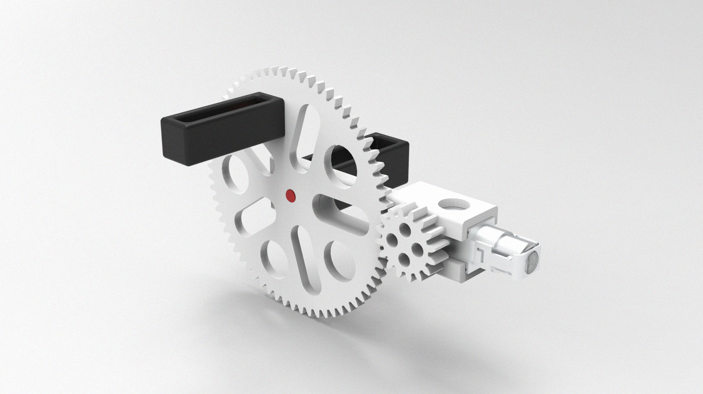

# Energy-tools

This is a collection of energy-related tools/research/projects for the Energy class taught at ITP NYU.

## Kinetic energy

### 1. [Hand crank gear sets for DC motor](./hand-crank-gears/)

