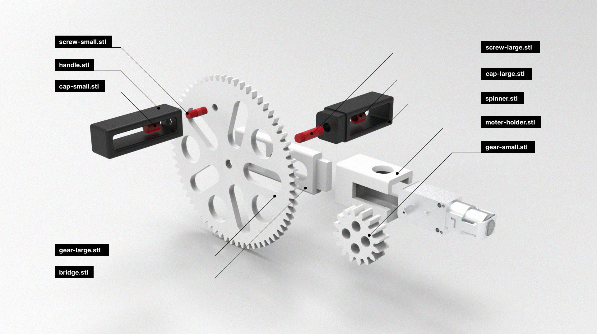

# Hand crank gear sets for DC motor

The current version only fits a [TT DC motor](https://www.adafruit.com/product/3777). Supports for additional motors might be added in the future. You can also derive from the source model file and adapt to your design.

## 3D printing instruction

### File selection

1. By default, you can just print the all-in-one.stl file. It contains all the components and is arranged and oriented properly.
2. If you want to print individual parts, you may refer to the assembly guide below to choose the parts desired. The orientaion of each part is already configured to print without any support.

### Print setting

**IMPORTANT: Please don't use support or brim.**
The dafult print setting on most printers should work, but please don't add support or brim as it might affect the fitting of the screws and threads.

Some reference for default print setting:

- Layer height 0.2mm
- Initial layer height 0.2mm
- Infill density 15%
- Wall loops 2

## Assembly

