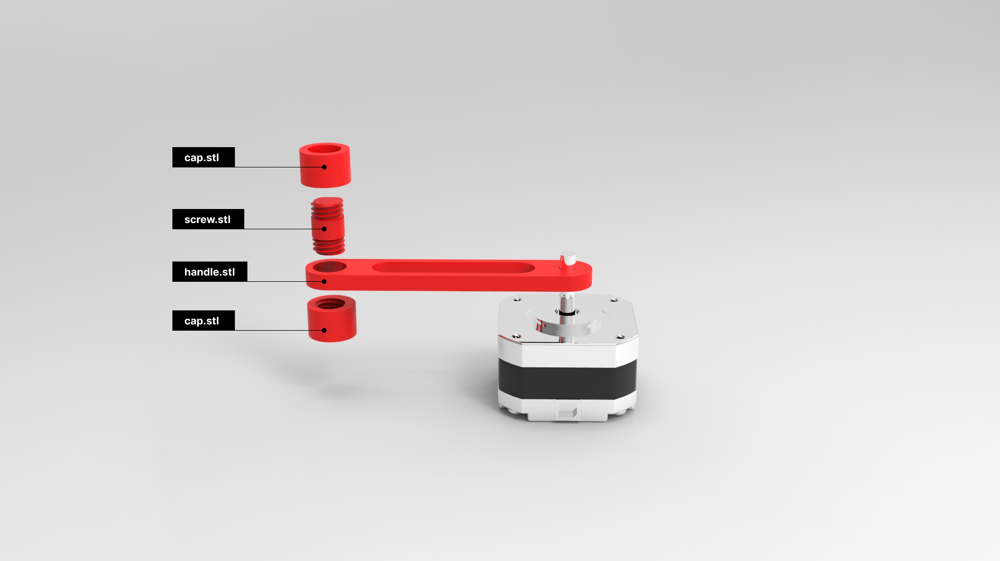

# Single spinning handle for Stepper motor

## 3D printing instruction

### File selection

1. By default, you can just print the [all-in-one.stl](./all-in-one.stl) file. It contains all the components and is arranged and oriented properly.
2. If you want to print individual parts, you may refer to the assembly guide image above to choose the parts desired. The orientaion of each part is already configured to print without any support.

### Print setting

:warning: **IMPORTANT: Please don't use support or brim.**

The dafult print setting on most printers should work, except that support or brim should be disabled as it might affect the fitting of the screws and threads.

:warning: _If you are using ITP's printer, some parts might come out a little too tight. Try to print with the finest setting you can._

Some reference for default print setting:

- Layer height 0.2mm
- Initial layer height 0.2mm
- Infill density 15%
- Wall loops 2
